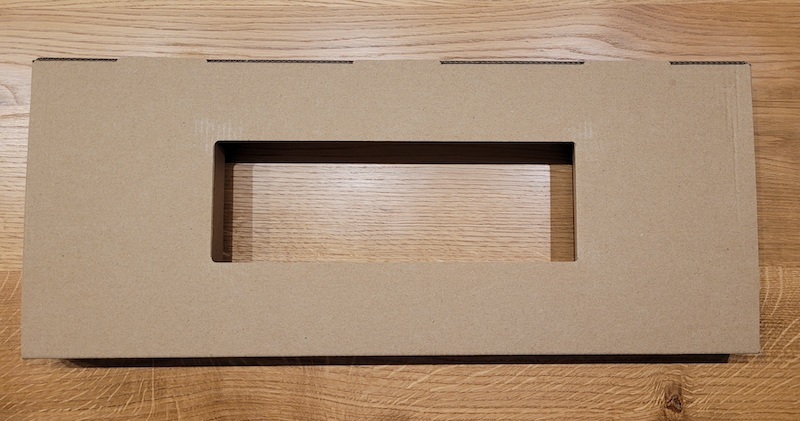

# Assembly

Each box contains an insert which doubles as an assembly station that is going to make it easier for you to assemble your Counundrum.

Simply take the cardboard insert, flip it and bend the flaps.

## Steps

1. Take the top piece with the plate mounted and push housings into the holes. You should hear a gentle click.
2. Place the sliders into the housings.
3. Put rubber domes on top of the sliders.
4. Place the springs into the rubber domes.

:::note
If you're missing a spring double-check if 2 springs aren't stacked together.
:::
5. Align the domes.
6. Gently place the PCB while aligning the holes.
7. Screw in the PCB to the top piece.
8. Screw in the bottom piece to the top piece.
